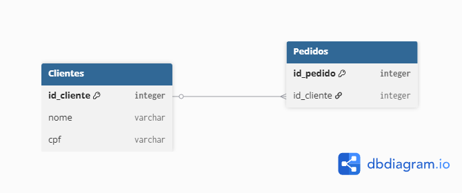

# Banco de Dados

## Índice

1. **Introdução**
2. **Modelagem de Dados**
3. **O Modelo Relacional**
4. **Níveis de Abstração**
5. **Etapas da Modelagem**

---

## 1. Introdução a Banco de Dados

Conceitos fundamentais para compreensão da área.

* **Dados:** Fatos em formas primárias (brutos, sem contexto).
* **Banco de Dados:** É uma coleção organizada de dados, estruturada para facilitar a inserção, atualização e consulta.

---

## 2. Modelagem de Dados

Consiste na criação de um modelo — uma estrutura abstrata — do banco de dados.

* **Objetivo:** Analisar e definir os requisitos necessários para atender às regras de negócio.
* **Definições:** Estabelece formatos (tipos de dados) e restrições de integridade.

---

## 3. O Modelo Relacional

Neste modelo, os dados são armazenados em tabelas que possuem relações entre si, garantindo a precisão e a consistência da informação.

### Elementos do Modelo Relacional

#### A. Tabela (ou Relação)

É a estrutura básica de armazenamento.

* **Função:** Representa uma entidade do mundo real.
* **Exemplo:** Tabela de *Clientes*, Tabela de *Produtos*.

#### B. Registro (ou Tupla/Linha)

Representa uma ocorrência específica de uma entidade.

* **Exemplo:** Em uma tabela de Clientes, a linha contendo os dados do cliente "Fábio" é um registro.

#### C. Coluna (ou Atributo)

Descreve as características das entidades.

* **Exemplo:** A coluna "Nome" armazena apenas nomes; a coluna "Telefone" armazena apenas números de contato.

#### D. Chave Primária (Primary Key - PK)

É uma coluna (ou combinação de colunas) que identifica um registro de forma **única**.

* **Regra:** Não pode haver valores repetidos nem nulos.
* **Função:** Diferenciar inequivocamente um registro do outro (Ex: CPF, ID ou Código do Cliente).

#### E. Chave Estrangeira (Foreign Key - FK)

É uma coluna usada para criar o **relacionamento** entre duas tabelas.

* **Funcionamento:** Geralmente conecta-se à Chave Primária de outra tabela, criando um vínculo referencial.

#### F. Relacionamento

É a associação lógica entre tabelas.

* **Função:** Permite cruzar dados para gerar informação (Ex: Saber "qual cliente comprou qual produto").

---

## 4. Níveis de Abstração (Modelos)

A modelagem ocorre em três níveis progressivos de detalhe:

1. **Modelo Conceitual (MER/DER):** Abstrato e focado no negócio. Independe de software.
2. **Modelo Lógico:** Implementação das estruturas (definição de tabelas, chaves primárias e estrangeiras).
3. **Modelo Físico:** Script SQL e implementação final no SGBD (Sistema Gerenciador de Banco de Dados) específico.

---

## 5. Etapas da Modelagem

O processo lógico para estruturar o banco:

1. **Identificação de Entidades:** Definição dos substantivos principais do sistema (o que será armazenado), que se traduzem em tabelas.
2. **Definição de Atributos:** Determinação das características e propriedades que definem cada entidade (as colunas).
3. **Estabelecimento de Relacionamentos:** Definição de como as tabelas se conectam e interagem entre si.

---

Aqui está o tópico de Relacionamentos adicionado à estrutura da apostila, mantendo a formatação direta e técnica.

---

## 6. Relacionamentos

O relacionamento é o terceiro pilar do Modelo Entidade-Relacionamento (MER), unindo as **Entidades** e os **Atributos**.

* **Definição:** Estrutura que define a associação entre ocorrências de entidades.
* **Função:** Conectar informações de tabelas distintas, transformando dados isolados em informação contextualizada.
* **Objetivo:** Permitir consultas complexas (Joins) para responder perguntas de negócio (ex: "Quem comprou o quê?").

### 6.1. Grau do Relacionamento

O grau indica o número de entidades envolvidas em uma única associação.

1. **Relacionamento Unário (Auto-relacionamento/Recursivo):**
* Uma única entidade relaciona-se consigo mesma.
* *Exemplo:* `Funcionário` *gerencia* `Funcionário`. (Um gerente é também um funcionário).

2. **Relacionamento Binário (Grau 2):**
* Associação entre duas entidades distintas. **É o padrão mais comum.**
* *Exemplo:* `Cliente` *realiza* `Pedido`.

3. **Relacionamento Ternário (Grau 3):**
* Associação simultânea entre três entidades indispensáveis para o fato.
* *Exemplo:* `Médico` *prescreve* `Medicamento` para `Paciente`.

### 6.2. Chaves

A "ponte" entre as tabelas é construída através de chaves:

* **Chave Primária (PK):** Identidade única do registro na tabela principal (Pai).
* **Chave Estrangeira (FK):** Referência na tabela secundária (Filho) que aponta para a PK da tabela principal.

---

### Exemplo Prático de Diagrama (DER)

**Cenário:** Sistema de Vendas Simples.
**Entidades:** `Clientes` e `Pedidos`.
**Relacionamento:** Um cliente pode fazer vários pedidos, mas um pedido pertence a um único cliente (1:N).

No diagrama a cima determinamos a relação entre a tabela `Clientes` à tabela `Pedidos`.

1. **A Ligação:** A coluna `id_cliente` dentro da tabela `Pedidos` não aceita qualquer número; ela só aceita valores que já existam na coluna `id_cliente` da tabela `Clientes`.
2. **A Leitura:** Quando o sistema lê o Pedido 5002, ele encontra a FK com valor "101". O banco de dados vai até a tabela `Clientes`, procura a PK "101" e retorna o nome "João Silva".
3. **Integridade:** Isso impede que um pedido seja criado para um cliente que não existe.

---

**Deseja adicionar o tópico sobre "Cardinalidade" (1:1, 1:N, N:N) agora para complementar este exemplo?**

___
___

### Plano de Estudos

#### Fase 1: Fundamentos Críticos 

* **Modelagem de Dados:**
* **Entidades e Relacionamentos:** Diferenciar cardinalidades (1:1, 1:N, N:N) e saber resolver o  com tabelas associativas.
* **Normalização:** Dominar até a **3ª Forma Normal (3FN)** para evitar redundância e anomalias de inserção/deleção.
* **Integridade Referencial:** Entender profundamente `FOREIGN KEY`, `CASCADE`, `RESTRICT` e `SET NULL`.

* **SQL:**
* **DDL vs DML:** Criação de estrutura (`CREATE`, `ALTER`) vs Manipulação (`INSERT`, `UPDATE`, `DELETE`).
* **Joins:** Saber exatamente quando usar `INNER JOIN` (interseção) vs `LEFT JOIN` (preserva lado esquerdo) vs `FULL OUTER JOIN`.
* **Agrupamento:** `GROUP BY`, `HAVING` e funções de agregação (`COUNT`, `SUM`, `AVG`).

#### Fase 2: Integridade e Concorrência

* **Transações (ACID):**
* **Atomicidade:** "Tudo ou nada".
* **Consistência:** O banco sempre muda de um estado válido para outro.
* **Isolamento:** Níveis de isolamento (`Read Committed`, `Repeatable Read`, `Serializable`) e problemas de concorrência (Dirty Read, Phantom Read).
* **Durabilidade:** Persistência garantida após o commit.
* **Locks:** Diferença entre *Pessimistic Locking* (trava o registro) e *Optimistic Locking* (versionamento de linha).

#### Fase 3: Integração com Backend 

* **Drivers vs ORMs:**
* **Driver:** Psycopg2 (PostgreSQL), PyMySQL.
* **ORM:** SQLAlchemy (padrão ouro em Python), Django ORM. Entender o problema "N+1 selects".

* **Migrations:**
* Versionamento de schema.
* Como fazer *downgrades* seguros.
* Gerenciamento de conflitos de migração em times.

#### Fase 4: Além do Relacional (NoSQL)

*Para cenários específicos onde o SQL não escala bem.*

* **Key-Value (Redis):** Essencial para **Cache** e filas simples.
* **Document (MongoDB):** Para dados não estruturados ou schemaless. Entender quando desnormalizar é vantajoso.

---

*database.py:*  responsável por criar a conexão com o nosso banco de dados. Antes disso, precisamos criar o banco de dados no Postgres e também as credenciais para acessá-lo.

*main.py:* é onde definiremos as rotas da nossa aplicação, os endpoints, ou seja, as URLs que acessamos para criar estudantes, matrículas e até excluir estudantes e matrículas.

*models.py:* definiremos as entidades da nossa aplicação. No nosso exemplo, as entidades são estudantes e matrículas. Portanto, os modelos que criaremos serão referentes a estudantes e matrículas.

*esquemas.py:* Os esquemas são a parte da aplicação referente à validação dos dados. Eles definem o tipo de atributo que temos em cada entidade, como string, número, integer, etc. 

____
____

#### Exercício

Para consolidar o conhecimento das conversas anteriores:

1. Crie um modelo físico de um sistema de pedidos (Clientes, Produtos, Pedidos, Itens do Pedido).
2. Popule com dados fictícios.
3. Crie uma query que traga: *Nome do Cliente, Data do Pedido e Valor Total*, usando `INNER JOIN` e `SUM/GROUP BY`.
4. Use o **Alembic** para alterar a tabela de Clientes (ex: adicionar coluna "CPF") e aplique a migração.